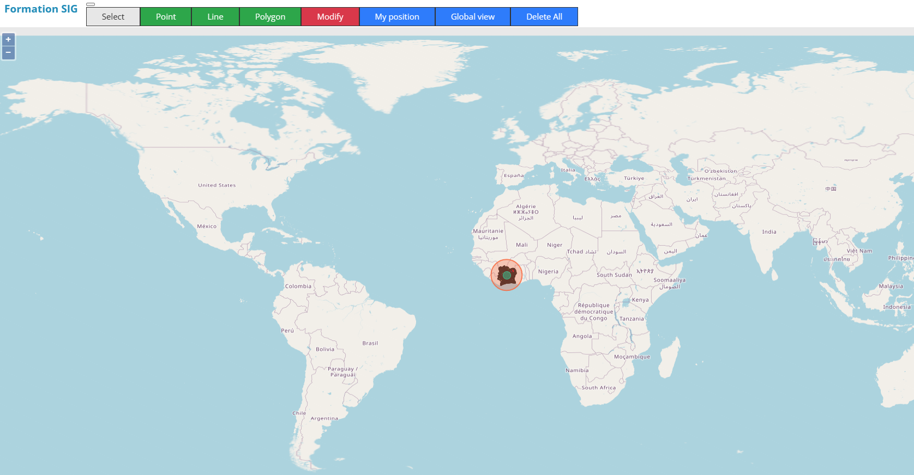

## 🌍 OpenLayers Geospatial Project

Welcome to the **OpenLayers Geospatial Project**! This repository contains everything you need to visualize, manage, and interact with geospatial data using **OpenLayers**, **GeoServer**, and **PostgreSQL/PostGIS**.

---

## 📚 Table of Contents

- [🚀 Project Overview](#-project-overview)
- [🛠 Prerequisites](#-prerequisites)
- [📦 Installation and Setup](#-installation-and-setup)
  - [1. PostgreSQL and PostGIS Setup](#1-postgresql-and-postgis-setup)
  - [2. GeoServer Configuration](#2-geoserver-configuration)
  - [3. Backend Server Setup](#3-backend-server-setup)
  - [4. OpenLayers Client Setup](#4-openlayers-client-setup)
- [📋 How It Works](#-how-it-works)
- [📸 Screenshots](#-screenshots)
- [👥 Contribution](#-contribution)
- [📄 License](#-license)

---

## 🚀 Project Overview

This project allows you to:

1. **Visualize Geospatial Layers**: Use **OpenLayers** to display maps and spatial data interactively.
2. **Manage Geospatial Data**: Publish, query, and update geospatial data through **GeoServer** and **PostgreSQL/PostGIS**.
3. **Serve Data Efficiently**: Leverage Web Map Service (WMS) or Web Feature Service (WFS) for seamless data exchange.

---

## 🛠 Prerequisites

Before setting up the project, ensure the following are installed on your system:

- **npm** and **Node.js**: To run the server backend.
- **PostgreSQL** with **PostGIS Extension**: For geospatial data storage.
- **GeoServer**: To publish and manage geospatial layers.
- **A modern browser**: To interact with the OpenLayers-based client.

---

## 📦 Installation and Setup

### 1. PostgreSQL and PostGIS Setup

1. Install PostgreSQL and PostGIS.
   ```bash
   sudo apt update
   sudo apt install postgresql postgresql-contrib postgis
   ```
2. Create a database for geospatial data:
   ```sql
   CREATE DATABASE spatial_data;
   \c spatial_data
   CREATE EXTENSION postgis;
   ```
3. Configure the database credentials in the server code (e.g., `service.js`).

---

---

### 2. GeoServer Configuration

1. **Install GeoServer**:

   - Download GeoServer from [geoserver.org](https://geoserver.org/) and follow the installation instructions.

2. **Create a New Layer**:

   - Access the GeoServer interface.
   - Add a **data store** connection (e.g., to a PostgreSQL database).
   - Create a **new layer** by importing data from your database or uploading a file (e.g., shapefile).

   Here's an example of the layer creation page in GeoServer:


3. **Configure Styles**:

   - Use **SLD** (Styled Layer Descriptor) files to define the styles for your layers.

4. **Test the Services**:
   - - Verify WMS/WFS endpoints in the GeoServer web interface .

---

### 3. Backend Server Setup

1. Navigate to the `server` directory:

   ```bash
   cd server
   ```

2. Install dependencies and start the server:

   ```bash
   npm install
   node service.js
   ```

3. The server will act as middleware, connecting the PostgreSQL database and GeoServer to the OpenLayers client.

---

### 4. OpenLayers Client Setup

1. Link your WMS/WFS services to the OpenLayers map in your web client code.

2. Customize the map interface with interactive features like zooming, panning, and querying layers.

3. Deploy the client by hosting it on a local or remote web server.

---

## 📋 How It Works

1. **Data Flow**:

   - Spatial data is uploaded to **GeoServer** or stored directly in **PostgreSQL/PostGIS**.
   - GeoServer publishes this data as WMS/WFS services.
   - The backend server interacts with GeoServer and PostgreSQL to serve data to the web client.

2. **User Interaction**:

   - Users view and interact with the data via the **OpenLayers** web application.

3. **Data Storage and Updates**:
   - PostgreSQL/PostGIS handles spatial data storage and processing, while GeoServer enables visualization.

---

## 📸 Screenshots

1. **Interactive Map with OpenLayers**  
   

2. **Displaying Shapes from the Database**  
   

3. **Zoomed-in View of a Local Position**  
   
4. **Displaying the Global View of the Map**
   

---

## 👥 Contribution

We welcome contributions! To contribute:

1. Fork the repository.
2. Create a feature branch.
3. Submit a pull request describing your changes.

---

## **🧑‍💻 Project By**

<a href="https://github.com/AnasBenAmor10/OpenLayers_Geospatial_Project/graphs/contributors">
    
</a>
